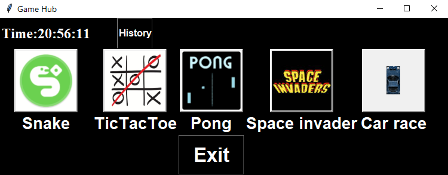
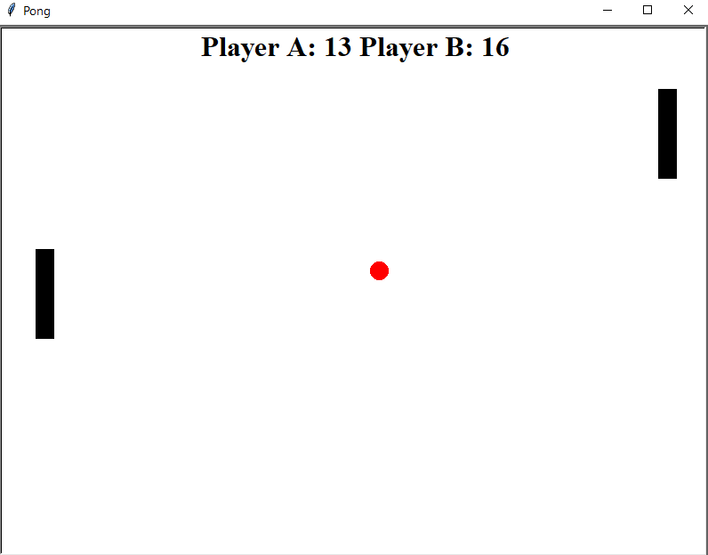
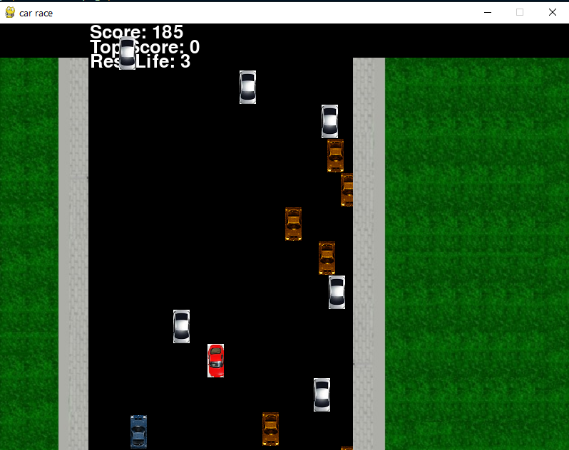
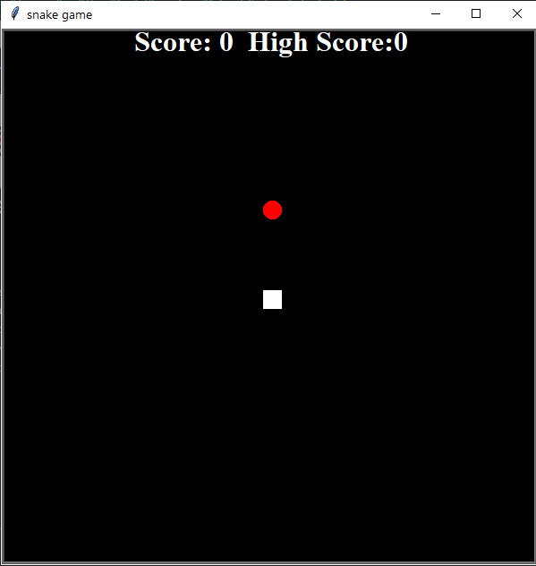
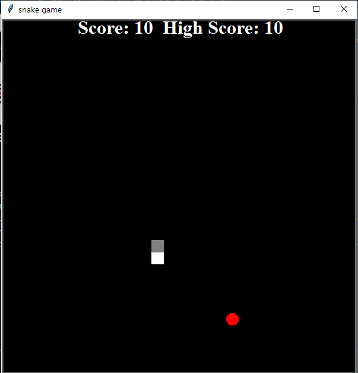
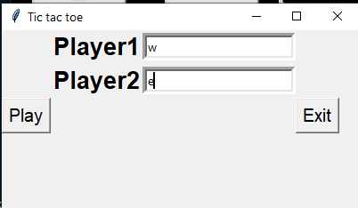
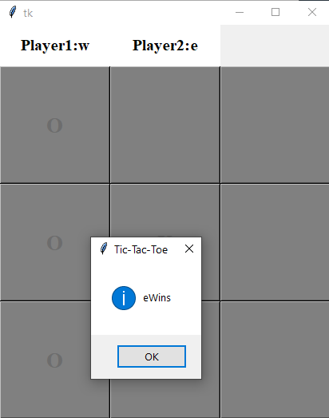
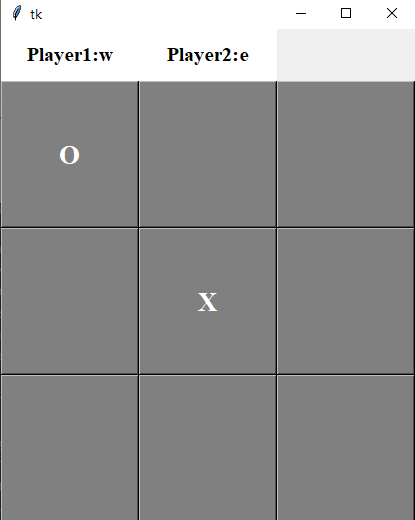
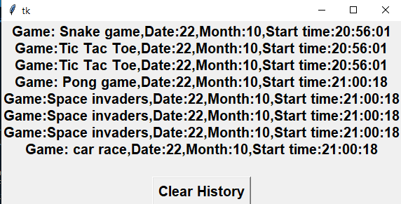

# Game Hub

1. An application that allows parents to restrict their children's excess use of computer games by adding a time limit.
2. This program has features that enable parents to access the application and monitor their children.
3. Developed front-end software and worked on verification and data retrieval process.

## Screenshots

